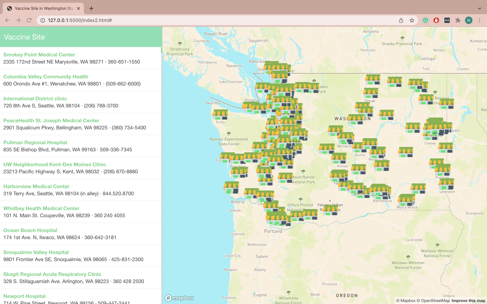

# Covid-19 Vaccination provider in Washington State in 2021

## Project Title
Covid-19 vaccination provider location in Washington State (2021)

## Project Descripton 
This project is an interactive web map that features the Covid-19 Vaccination provider location in the Washington State. Since Covid-19 started, one of the most important ways to prevent the spread has been to get vaccinated. Furthermore, the first covid case in United State was founded in January 20,2020 in Washington State. Therefore, I want to focus on providing Covid-19 vaccination Site. To make it easier for the user, I tried to create a side bar that allows user to click on and it takes them to the location on the map. Which then becomes a pop-up that provide the name, the location and wether they require appointment or not. 

### Project Goal 
Through this project, I hope to encourage more people to get the Covid-19 vaccine, as well as, providing information on the Covid-19 vaccine site so it is more accessible to everyone. Therefore, in my project I tried to provide all the necessary information, which include the name of the site, the location, phone number and whether or not they require appointment. Furthermore, I personally think that it is important to know that there are resources for Covid-19 vaccination near you. 

### Main Function 
The main function of the interactive map is to provide more information about the vaccination site. The first part is the side bar, which I include the name, address and phone number of the vaccination site. If you clicked on any site, it will take you to that specific site on the map. The site on the map is zoomed in and will contain a pop-up that contain the name of the site, the location and whether or not appointment is required. Hopefully, this will allow the people who look at the mapt o find the location of the vaccination site that is closet to them.

## Data Source and Acknowledgement
The Covid-19 Vaccination Provider Location is from ArcGIS Hub. The information displayed on the map is the most recently updated data, which is December 9th 2020.
The applies libraries is mapbox gl js 
Web serviced used are [mapbox](pk.eyJ1IjoibmxlcnR2IiwiYSI6ImNrd3ZzNDhkbDBvaHQyd3V0aWN4ZHhweG4ifQ.Urrs8iPJJv64653D_2GA3g) for base map and GitHub

